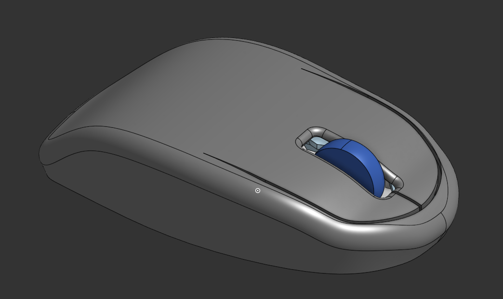
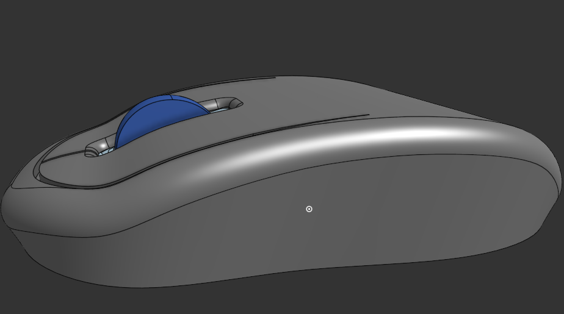

# Mooose
Just a humble simple mouse :p

# Model Files 

.stl files are in CAD/PrintExport directory
3d model files for viewing in different format is in CAD/Model
and the parts used as reference are in CAD/ImportParts

# 3D Printing
Just print the .stl file in CAD/PrintExport

# View or Make Something On Top of It?

This is designed in OnShape and the document can be viewed using this link: [https://cad.onshape.com/documents/983f546f674b6d6a845351bb/w/8131590bbf70e65e3e46648d/e/3519d6636146fab75fb50fce?renderMode=0&leftPanel=false&uiState=69dcf2a85e5847e331ff7a96](https://cad.onshape.com/documents/983f546f674b6d6a845351bb/w/8131590bbf70e65e3e46648d/e/3519d6636146fab75fb50fce?renderMode=0&leftPanel=false&uiState=69dcf2a85e5847e331ff7a96)

# Just Some Pictures of How it Looks

